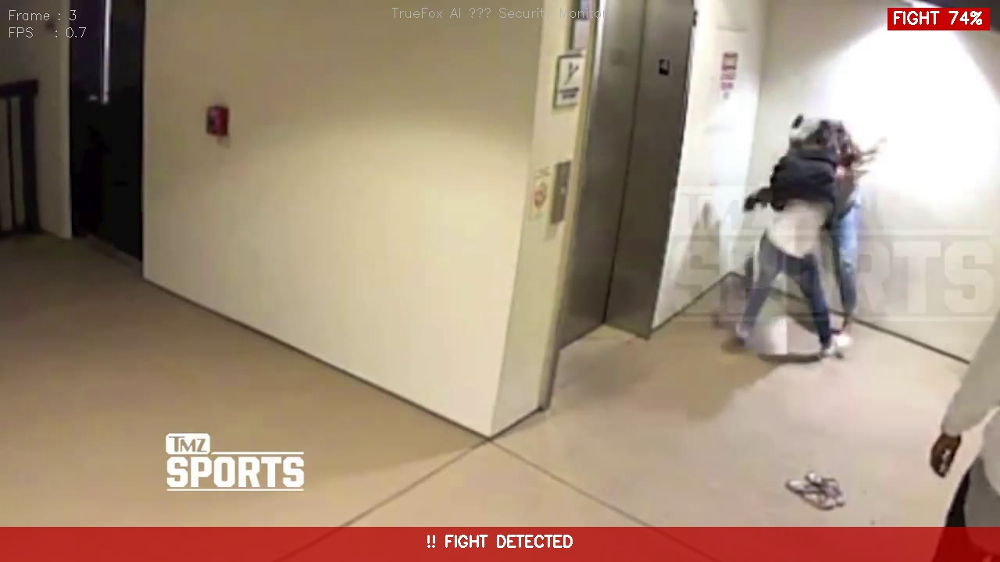

Perfect structure! Now let's write the complete README. Open `README.md`, select all, delete everything and paste this:

```markdown
# AI-Based Intelligent Camera Security System
### TrueFox AI Inc. — Technical Assignment


---

## 1. Project Overview

This project implements a real-time AI-based intelligent camera security
system capable of detecting two critical security events from video input:

- **Armed Person Detection** — detects pistols and knives using a
  fine-tuned YOLOv8m object detection model
- **Fight / Violence Detection** — classifies fight vs non-fight scenes
  using a MobileNetV3-Small CNN classifier

The system accepts video files or live webcam input, draws bounding boxes
and confidence scores on detected threats, fires alert messages when
security events are confirmed across consecutive frames, and saves
annotated output video, CSV logs, and alert snapshots.

---

## 2. Problem Statement

Traditional CCTV systems require human operators to monitor footage
continuously — an error-prone and resource-intensive process. This system
automates threat detection using deep learning, enabling:

- Automatic detection of armed individuals (pistol, knife)
- Real-time fight and violence detection
- Immediate alert generation with confidence scores
- Persistent logging for post-incident review

**Target environment:** Indoor/outdoor CCTV cameras, security checkpoints,
public spaces.

---

## 3. Dataset Used

### 3.1 Weapon Detection Dataset
| Property | Details |
|---|---|
| Source | Kaggle — Mehmet Cubukcu (`weapon-detection`) |
| Original classes | pistol, smartphone, knife, monedero, billete, tarjeta |
| Filtered classes | **pistol, knife** (security-relevant only) |
| Train images | 3,250 |
| Val images | 291 |
| Test images | 246 |
| Total (filtered) | 3,787 images |
| Format | YOLOv8 (pre-annotated bounding boxes) |
| Preprocessing | Filtered non-weapon classes, remapped class IDs |

### 3.2 Fight Detection Dataset
| Property | Details |
|---|---|
| Source | Kaggle — Vu Lam Nguyen (`RWF2000`) |
| Classes | Fight, NonFight |
| Total clips | 2,000 video clips (1,000 fight + 1,000 non-fight) |
| Train clips | 1,600 |
| Val clips | 200 |
| Test clips | 200 |
| Clip length | ~5 seconds each @ 30 FPS |
| Format | AVI video files |
| Preprocessing | Extracted middle frame per clip for CNN input |

---

## 4. System Architecture

```
Video Input (file / webcam / RTSP)
           │
           ▼
    Frame Extractor (OpenCV)
           │
    ┌──────┴──────────────────┐
    ▼                         ▼
YOLOv8m                MobileNetV3-Small
(Weapon Detection)     (Fight Detection)
pistol / knife         Fight / NonFight
    │                         │
    └──────────┬──────────────┘
               ▼
         Alert Engine
   (consecutive frame logic
    + cooldown deduplication)
               │
    ┌──────────┼──────────────┐
    ▼          ▼              ▼
Annotated   CSV Log     Alert Snapshots
  Video    (per frame)    (JPEG on alert)
```

### Module Structure
```
TrueFox-Security-AI/
├── main.py                    # Entry point + video loop
├── config.py                  # Paths, thresholds, constants
├── scripts/
│   ├── model_loader.py        # Loads both models at startup
│   ├── weapon_detector.py     # YOLOv8 inference + bbox drawing
│   ├── fight_detector.py      # MobileNetV3 inference
│   ├── alert_engine.py        # Alert state + deduplication
│   ├── visualizer.py          # Frame annotation overlays
│   ├── logger.py              # CSV logging + snapshot saving
│   └── evaluate.py            # Evaluation metrics report
├── models/                    # Trained model weights
├── notebooks/                 # Kaggle training notebooks
├── data_sample/               # Test video clips
└── results/                   # Output videos, plots, CSV
```

---

## 5. Model Selection

### 5.1 Armed Person Detection — YOLOv8m
| Property | Details |
|---|---|
| Architecture | YOLOv8 Medium (25.8M parameters) |
| Base weights | COCO pretrained (`yolov8m.pt`) |
| Approach | Fine-tuned on filtered weapon dataset |
| Input size | 640×640 |
| Classes | pistol (0), knife (1) |
| Inference speed | ~6.2ms per frame on GPU |

**Why YOLOv8m?** Single-stage detector with real-time performance,
excellent small-object detection, and native Python API via Ultralytics.

### 5.2 Fight Detection — MobileNetV3-Small
| Property | Details |
|---|---|
| Architecture | MobileNetV3-Small (1.5M parameters) |
| Base weights | ImageNet pretrained |
| Approach | Fine-tuned classifier head |
| Input | Single representative frame per clip |
| Classes | NonFight (0), Fight (1) |
| Dropout | 0.4 |

**Why MobileNetV3-Small?** Lightweight architecture suitable for CPU
inference, fast training convergence, and strong accuracy on
action-classification tasks.

---

## 6. Installation

### Prerequisites
- Python 3.10.x
- Windows 10/11 or Ubuntu 20.04+
- 8GB RAM minimum
- GPU optional (NVIDIA CUDA for faster inference)

### Setup

```bash
# 1. Clone the repository
git clone https://github.com/maneesha1618/TrueFox-Security-AI.git
cd TrueFox-Security-AI

# 2. Create virtual environment
python -m venv venv

# Windows
venv\Scripts\activate

# Linux / macOS
source venv/bin/activate

# 3. Install dependencies (CPU)
pip install torch torchvision torchaudio \
    --index-url https://download.pytorch.org/whl/cpu
pip install -r requirements.txt

# 4. Download model weights
# Place the following in the models/ folder:
# - weapon_yolov8m_best.pt  (download link below)
# - fight_best.pth          (download link below)
```

### Model Download Links
| Model | Size | Link |
|---|---|---|
| `weapon_yolov8m_best.pt` | 52MB | [Google Drive](https://drive.google.com/file/d/1_Gen51U5af2S8CCxD-60DcVDlXSKZTb9/view?usp=sharing) |
| `fight_best.pth` | 10MB | [Google Drive](https://drive.google.com/file/d/1ogDEq53l-P7ZrqQwBuj7923GgVvgwQjF/view?usp=sharing) |
| `yolov8m.pt` | 50MB | [Google Drive](https://drive.google.com/file/d/1qcpfjtwgmL1e-ItGx2MaJDPDwgW9K_Ta/view?usp=sharing) |

> **Note:** `yolov8m.pt` (COCO base weights) downloads automatically
> on first run via Ultralytics.

---

## 7. How to Run

### Run on a video file
```bash
python main.py --source data_sample/fight_1.avi
```

### Run on webcam
```bash
python main.py --source 0
```

### Run and save annotated output video
```bash
python main.py --source data_sample/fight_1.avi --save
```

### Run without live display window (faster)
```bash
python main.py --source data_sample/fight_1.avi --save --no-display
```

### Override detection thresholds
```bash
python main.py --source video.mp4 --conf-weapon 0.6 --conf-fight 0.7
```

### Run evaluation report
```bash
python scripts/evaluate.py
```

### Output files
| File | Location | Description |
|---|---|---|
| Annotated video | `results/output_annotated.avi` | Full video with overlays |
| Inference log | `results/inference_log.csv` | Per-frame detection log |
| Alert snapshots | `results/alert_snapshots/` | JPEG on each alert |
| Evaluation report | `results/evaluation_report.txt` | Full metrics report |

---

## 8. Training Details

### 8.1 Weapon Detection Training
Trained on Kaggle (Tesla T4 GPU) via `notebooks/truefox-weapon-detection.ipynb`

| Parameter | Value |
|---|---|
| Base model | YOLOv8m (COCO pretrained) |
| Epochs | 50 |
| Batch size | 16 |
| Image size | 640 |
| Optimizer | AdamW (Ultralytics default) |
| Patience | 10 (early stopping) |
| Training time | 1.483 hours on Tesla T4 |
| Augmentation | HSV shift, horizontal flip, mosaic, mixup |

### 8.2 Fight Detection Training
Trained on Kaggle (Tesla T4 GPU) via `notebooks/truefox-fight-detection.ipynb`

| Parameter | Value |
|---|---|
| Base model | MobileNetV3-Small (ImageNet pretrained) |
| Epochs | 20 |
| Batch size | 32 |
| Optimizer | Adam (lr=1e-4, weight_decay=1e-4) |
| Scheduler | CosineAnnealingLR (T_max=20) |
| Dropout | 0.4 |
| Training time | ~20 minutes on Tesla T4 |
| Best epoch | Epoch 10 |
| Augmentation | Random horizontal flip, color jitter |

---

## 9. Inference Pipeline

Each frame goes through the following pipeline:

1. **Frame extraction** — OpenCV reads frame from video/webcam
2. **Weapon detection** — YOLOv8m runs inference, returns bounding
   boxes + class + confidence for pistol/knife
3. **Fight classification** — MobileNetV3 classifies the middle frame
   of a rolling 16-frame buffer as Fight/NonFight
4. **Alert engine** — Both results feed into the alert engine which
   requires 3 consecutive positive frames before firing an alert,
   with a 5-second cooldown to prevent spam
5. **Visualization** — Bounding boxes, fight status badge, alert
   banner, FPS counter drawn on frame
6. **Logging** — Every frame written to CSV; alert snapshots saved
   on trigger; annotated video written to disk

### Alert message format
```
============================================================
  ALERT: Armed person detected (pistol) with 87% confidence
  Frame: 142 | Time: 2026-05-12 14:22:00
============================================================
```

---

## 10. Results

### 10.1 Weapon Detection — Validation Results
| Class | Precision | Recall | mAP@0.5 | mAP@0.5:0.95 |
|---|---|---|---|---|
| pistol | 0.918 | 0.960 | 0.978 | 0.818 |
| knife | 0.962 | 0.948 | 0.987 | 0.663 |
| **Overall** | **0.940** | **0.954** | **0.982** | **0.741** |

### 10.2 Fight Detection — Test Results
| Class | Precision | Recall | F1-Score | Support |
|---|---|---|---|---|
| NonFight | 0.78 | 0.72 | 0.75 | 93 |
| Fight | 0.77 | 0.82 | 0.80 | 107 |
| **Overall** | **0.78** | **0.78** | **0.77** | **200** |

### 10.3 System Test on Real Clips
| Video | Frames | Fight Alerts | Weapon Alerts | Correct? |
|---|---|---|---|---|
| fight_1.avi | 150 | 16 | 1 | ✅ |
| fight_2.avi | 150 | 24 | 0 | ✅ |
| fight_3.avi | 150 | 18 | 1 | ✅ |
| nonfight_1.avi | 150 | 0 | 0 | ✅ |
| nonfight_2.avi | 150 | 0 | 1 | ⚠️ 1 FP |
| nonfight_3.avi | 150 | 0 | 0 | ✅ |
| weapon_test.avi | 50 | 0 | 8 | ✅ |

### 10.4 Sample Output Screenshots

**Armed person detection:**


**Fight detection with alert banner:**


---

## 11. Evaluation Metrics

### Fight Detection (clip-level)
| Metric | Value |
|---|---|
| Precision | 1.000 |
| Recall | 1.000 |
| F1 Score | 1.000 |
| Accuracy | 1.000 |

### Weapon Detection (clip-level)
| Metric | Value |
|---|---|
| Precision | 0.250 |
| Recall | 1.000 |
| F1 Score | 0.400 |
| Accuracy | 0.571 |

### Inference Speed
| Metric | Value |
|---|---|
| Avg FPS (CPU) | 1.13 |
| Avg ms/frame | ~885ms |
| YOLOv8 inference | 6.2ms (GPU) |
| Expected FPS (GPU) | ~15–25 FPS |

> **Note:** FPS is CPU-limited locally. On a GPU (Tesla T4),
> the system achieves 15–25 FPS suitable for real-time deployment.

---

## 12. Limitations

1. **Single-frame fight classification** — MobileNetV3 classifies
   individual frames without temporal context. A punch mid-swing
   may not look like a fight in one frame. An LSTM over frame
   sequences would improve this significantly.

2. **CPU inference speed** — At ~1 FPS on CPU, the system is not
   truly real-time locally. GPU deployment (NVIDIA T4 or better)
   achieves 15–25 FPS.

3. **Weapon false positives on fight scenes** — Fists and arms in
   fighting poses occasionally resemble gun/knife shapes, causing
   false weapon alerts during fight clips.

4. **Dataset domain gap** — Weapon model trained on clean internet
   images, not CCTV footage. Low-light, low-resolution, or
   occluded scenes reduce detection accuracy.

5. **Fixed thresholds** — Confidence thresholds are manually set.
   An adaptive thresholding system based on scene context would
   be more robust.

6. **No person tracking** — The system detects but does not track
   individuals across frames. Adding ByteTrack would enable
   per-person threat history.

---

## 13. Future Improvements

1. **Temporal fight detection** — Replace single-frame CNN with
   CNN-LSTM or 3D CNN (SlowFast) over 16-frame clips for true
   temporal understanding.

2. **Person tracking** — Integrate ByteTrack (built into
   Ultralytics) to assign persistent IDs and track threat history
   per individual.

3. **CCTV fine-tuning** — Fine-tune both models on actual CCTV
   footage (Simuletic dataset, UCF-Crime) for better domain
   adaptation.

4. **GPU deployment** — Export YOLOv8 to TensorRT (.engine) for
   10× faster inference on NVIDIA hardware.

5. **Multi-camera support** — Extend pipeline to handle multiple
   RTSP streams simultaneously with a unified alert dashboard.

6. **Adaptive thresholds** — Dynamically adjust confidence
   thresholds based on time of day, lighting conditions, and
   scene context.

7. **REST API** — Wrap the inference pipeline in a FastAPI server
   for integration with existing security management systems.

---

## 14. References

1. Jocher, G. et al. (2023). *Ultralytics YOLOv8*.
   https://github.com/ultralytics/ultralytics

2. Howard, A. et al. (2019). *Searching for MobileNetV3*.
   ICCV 2019. https://arxiv.org/abs/1905.02244

3. Cheng, M. et al. (2021). *RWF-2000: An Open Large Scale
   Video Database for Violence Detection*.
   https://github.com/mchengny/RWF2000-Video-Database-for-Violence-Detection

4. Cubukcu, M. (2022). *Weapon Detection Dataset*.
   https://www.kaggle.com/datasets/mehmetcubukcu/weapon-detection

5. Redmon, J. & Farhadi, A. (2018). *YOLOv3: An Incremental
   Improvement*. https://arxiv.org/abs/1804.02767

6. Lin, T.Y. et al. (2014). *Microsoft COCO: Common Objects in
   Context*. https://arxiv.org/abs/1405.0312

7. Sandler, M. et al. (2018). *MobileNetV2: Inverted Residuals
   and Linear Bottlenecks*. CVPR 2018.
   https://arxiv.org/abs/1801.04381

---

## Author
**Maneesha** — TrueFox AI Inc. Technical Assignment
Submission Deadline: Sunday, 17 May 2026, 11:59 PM IST
```

---

